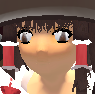
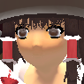

# nhm THF2 player models

These files are modified/fixed versions of the ones you can find on the [Touhou TF2 Vote](https://steamcommunity.com/groups/TouhouFortress2) steam group. They were recompiled to work with Jarateking's no-hats-mod which can be generated with [CleanTF2plus](https://github.com/JarateKing/CleanTF2plus).

- Fixed the player models' eyes.

- Removed bodygroups to allow the models to work nicer with the no-hats-mod.

### Bugs

- Eirin's backpack doesn't have a texture while übercharged.

- Patchouli flies to the moon when killed.

## Credits

I did not create any of the models in this repository, they're property of the [Touhou TF2 Vote](https://steamcommunity.com/groups/TouhouFortress2) steam group.

- A big thank you to Kirіsame the Awesome Witch! for maintaining the models and making the decompiled sources public.

- The original models can be downloaded from this [THF2 group discussion](https://steamcommunity.com/groups/TouhouFortress2/discussions/1/530645446312218115/).
